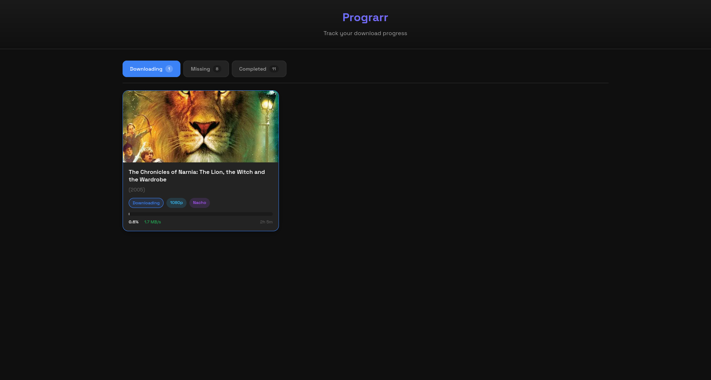

# Prograrr

A lightweight dashboard that aggregates and displays real-time download progress from your *arr stack (Sonarr, Radarr) combined with Jellyseerr requests and qBittorrent status.




## Features

- Unified view of all media requests from Jellyseerr
- Real-time download progress from Sonarr/Radarr queues
- Torrent status and speed from qBittorrent
- Clean, modern dark UI
- Automatic refresh every 15 seconds

## How It Works

Prograrr aggregates data from four services to provide a complete view of your media downloads:

| Service | Data Provided |
|---------|---------------|
| **Jellyseerr** | Requests list, requester, request status, media metadata (title, poster, TMDB/TVDB IDs) |
| **Sonarr** | TV show download queue, TVDB ID, download hash |
| **Radarr** | Movie download queue, TMDB ID, download hash |
| **qBittorrent** | Download progress %, speed, ETA, torrent state |

**Data flow:**
```
Jellyseerr (request info: title, poster, who requested)
    ↓ matched by TMDB/TVDB ID
Sonarr/Radarr (queue item with download hash)
    ↓ matched by hash
qBittorrent (real-time progress, speed, ETA)
```

All four services are required to display complete information. Without Jellyseerr you lose request metadata, without Sonarr/Radarr you can't link requests to downloads, and without qBittorrent you lose real-time progress.

## Quick Start

```bash
docker run -d \
  --name prograrr \
  -p 3000:3000 \
  -e JELLYSEERR_URL=http://jellyseerr:5055 \
  -e JELLYSEERR_API_KEY=your_jellyseerr_api_key \
  -e SONARR_URL=http://sonarr:8989 \
  -e SONARR_API_KEY=your_sonarr_api_key \
  -e RADARR_URL=http://radarr:7878 \
  -e RADARR_API_KEY=your_radarr_api_key \
  -e QBITTORRENT_URL=http://qbittorrent:8080 \
  -e QBITTORRENT_USERNAME=admin \
  -e QBITTORRENT_PASSWORD=adminadmin \
  ignacioavecilla/prograrr:latest
```

## Docker Compose Integration

Add Prograrr to your existing *arr stack `docker-compose.yml`:

```yaml
services:
  # ... your existing services (sonarr, radarr, jellyseerr, etc.)

  prograrr:
    image: ignacioavecilla/prograrr:latest
    container_name: prograrr
    environment:
      - TZ=America/New_York
      - PORT=3000
      - JELLYSEERR_URL=http://jellyseerr:5055
      - JELLYSEERR_API_KEY=${JELLYSEERR_API_KEY}
      - SONARR_URL=http://sonarr:8989
      - SONARR_API_KEY=${SONARR_API_KEY}
      - RADARR_URL=http://radarr:7878
      - RADARR_API_KEY=${RADARR_API_KEY}
      - QBITTORRENT_URL=http://qbittorrent:8080
      - QBITTORRENT_USERNAME=${QBITTORRENT_USERNAME}
      - QBITTORRENT_PASSWORD=${QBITTORRENT_PASSWORD}
    ports:
      - "3000:3000"
    restart: unless-stopped
```

### Using with VPN Container (Gluetun)

If your *arr apps run through a VPN container like Gluetun, point the URLs to the VPN container:

```yaml
  prograrr:
    image: ignacioavecilla/prograrr:latest
    container_name: prograrr
    environment:
      - JELLYSEERR_URL=http://jellyseerr:5055
      - JELLYSEERR_API_KEY=${JELLYSEERR_API_KEY}
      - SONARR_URL=http://gluetun:8989
      - SONARR_API_KEY=${SONARR_API_KEY}
      - RADARR_URL=http://gluetun:7878
      - RADARR_API_KEY=${RADARR_API_KEY}
      - QBITTORRENT_URL=http://gluetun:8080
      - QBITTORRENT_USERNAME=${QBITTORRENT_USERNAME}
      - QBITTORRENT_PASSWORD=${QBITTORRENT_PASSWORD}
    ports:
      - "3000:3000"
    restart: unless-stopped
    networks:
      - your_media_network

networks:
  your_media_network:
    external: true
```

## Environment Variables

| Variable | Required | Default | Description |
|----------|----------|---------|-------------|
| `PORT` | No | `3000` | Port the web server listens on |
| `JELLYSEERR_URL` | No | `http://localhost:5055` | Jellyseerr instance URL |
| `JELLYSEERR_API_KEY` | Yes | - | Jellyseerr API key |
| `SONARR_URL` | No | `http://localhost:8989` | Sonarr instance URL |
| `SONARR_API_KEY` | Yes | - | Sonarr API key |
| `RADARR_URL` | No | `http://localhost:7878` | Radarr instance URL |
| `RADARR_API_KEY` | Yes | - | Radarr API key |
| `QBITTORRENT_URL` | No | `http://localhost:8080` | qBittorrent Web UI URL |
| `QBITTORRENT_USERNAME` | No | `admin` | qBittorrent username |
| `QBITTORRENT_PASSWORD` | No | `adminadmin` | qBittorrent password |
| `TZ` | No | `UTC` | Timezone |

## Getting API Keys

### Jellyseerr
1. Open Jellyseerr and go to **Settings**
2. Click on **General**
3. Copy the **API Key** or generate a new one

### Sonarr
1. Open Sonarr and go to **Settings** > **General**
2. Under **Security**, copy the **API Key**

### Radarr
1. Open Radarr and go to **Settings** > **General**
2. Under **Security**, copy the **API Key**

### qBittorrent
1. Open qBittorrent and go to **Options** > **Web UI**
2. Ensure **Web User Interface** is enabled
3. Note the username and password configured

## API Endpoints

| Endpoint | Description |
|----------|-------------|
| `GET /api/requests` | Returns aggregated media requests with download status |
| `GET /api/overview` | Returns processed, ready-to-render data split into downloading and missing categories |
| `GET /api/health` | Health check endpoint |
| `GET /api/debug` | Debug info showing connection status to all services |

### `GET /api/overview`

A processed endpoint designed for client integrations (e.g. Jellyfin plugins). Returns two categories — **downloading** (active downloads) and **missing** (not found / not available) — with TV shows merged into single entries and episodes grouped by season.

Key behaviors:
- **Movies** have top-level `progress`/`speed`/`eta`/`quality` fields; `seasons` is `[]`
- **TV shows** have per-season aggregates (avg progress, total speed, max ETA) with per-episode detail; top-level progress fields are `null`
- Multiple Jellyseerr requests for different seasons of the same series are merged into one entry
- Completed/seeding episodes are filtered out — only active downloads are shown
- `effectiveStatus` reflects the best status across all episodes (`downloading` > `paused` > `queued` > `stalled`)

Response shape:

```json
{
  "downloading": [
    {
      "title": "The Simpsons",
      "mediaType": "tv",
      "posterUrl": "https://image.tmdb.org/t/p/w500/...",
      "year": 1989,
      "requestedBy": "nacho",
      "effectiveStatus": "downloading",
      "progress": null,
      "speed": null,
      "eta": null,
      "quality": null,
      "seasons": [
        {
          "seasonNumber": 4,
          "episodeCount": 2,
          "progress": 45.5,
          "speed": 5242880,
          "eta": 3600,
          "episodes": [
            {
              "episodeNumber": 3,
              "title": "Homer the Heretic",
              "progress": 45.5,
              "speed": 5242880,
              "eta": 3600,
              "status": "downloading",
              "quality": "1080p"
            }
          ]
        }
      ]
    },
    {
      "title": "Sinners",
      "mediaType": "movie",
      "posterUrl": "...",
      "year": 2025,
      "requestedBy": "nacho",
      "effectiveStatus": "downloading",
      "progress": 72.3,
      "speed": 3145728,
      "eta": 900,
      "quality": "1080p",
      "seasons": []
    }
  ],
  "missing": [
    {
      "title": "Send Help",
      "mediaType": "movie",
      "posterUrl": "...",
      "year": 2026,
      "requestedBy": "nacho",
      "effectiveStatus": null,
      "progress": null,
      "speed": null,
      "eta": null,
      "quality": null,
      "seasons": []
    }
  ]
}
```

## Troubleshooting

### "Loading requests..." forever
- Check that Prograrr can reach your services (use `/api/debug` endpoint)
- Ensure Prograrr is on the same Docker network as your other services
- Verify API keys are correct

### Services showing "HTTP error"
- Verify the service URLs are correct
- Check if services are accessible from the Prograrr container
- If using Docker, use container names instead of `localhost`

### Network Issues with Docker
If Prograrr can't connect to your services, make sure they're on the same Docker network:

```bash
# Check what network your services are on
docker inspect <container_name> --format '{{range $k, $v := .NetworkSettings.Networks}}{{$k}}{{end}}'

# Add external network to your docker-compose.yml
networks:
  your_network_name:
    external: true
```

## Development

Built with [Gleam](https://gleam.run/) using:
- **Wisp** - Web framework
- **Mist** - HTTP server

### Using Nix (Recommended)

The project includes a Nix flake for easy development setup:

```bash
# Clone the repository
git clone https://github.com/ignacioavecilla/prograrr.git
cd prograrr

# Enter the dev shell (installs Gleam, Erlang, etc.)
nix develop

# Or if you use direnv, it will activate automatically
direnv allow
```

### Manual Setup

```bash
# Install Gleam and Erlang manually, then:
gleam deps download

# Run locally (set environment variables first)
export JELLYSEERR_API_KEY=your_key
export SONARR_API_KEY=your_key
export RADARR_API_KEY=your_key
gleam run

# Build Docker image
docker build -t prograrr .
```

## License

MIT
